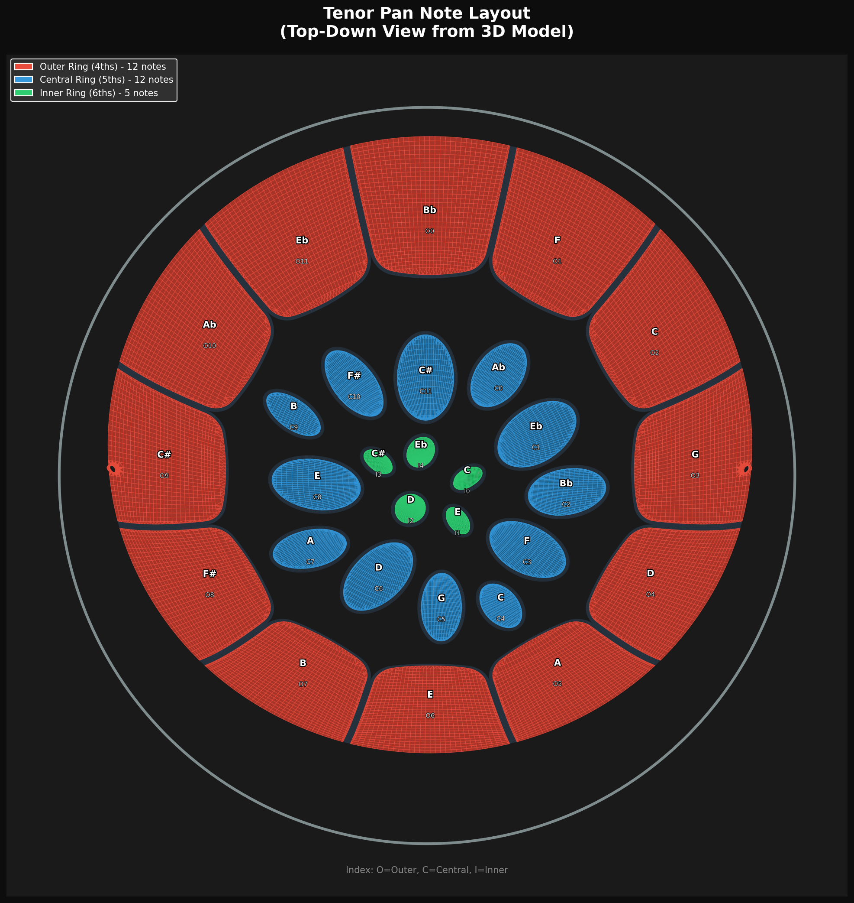

# deepPan

3D printable tenor steel pan with section generator, note pads, and interactive sound design tools.

**Live site:** [proflewis.github.io/deepPan](https://proflewis.github.io/deepPan/)

[](https://colab.research.google.com/github/profLewis/deepPan/blob/main/deepPan_Colab.ipynb)

## Project Overview

This project creates a **3D printable tenor steel pan** from a 3D scanned model. The pan is split into printable sections with individually mountable note pads, enabling replacement of damaged notes, experimentation with materials and tuning, and educational exploration of steel pan acoustics.

## Quick build (recreate the DEFINITIVE model from scratch)

The committed model in `pipeline_output/` is the **definitive build**. The
build pipeline below regenerates it byte-for-byte from `data/Tenor Pan only.obj`.

```bash
./build_from_scratch.sh         # full regenerate (~90 min)
python3 test_pipeline.py        # quick checksum check against committed manifest
python3 test_pipeline.py --full # full byte-for-byte regenerate-and-compare
```

The pipeline runs 14 stages:

1. Extract groove surfaces from source bowl
2. Solidify grooves (5 mm extrusion)
3. Generate 29 notepad meshes (no screw holes)
4. Build pan body (groove faces kept in body)
5. Extend outer-ring pad-hole boundaries
6. Thicken body to 5 mm solid
7. Generate per-pad groove-replacement ellipsoids
8. Merge body with central+inner ellipsoids
9. Voxel-remesh + pads + outer grooves + debris strip → `pan_printable.stl`
10. Split body into 7 printable pieces (truncate at Z=−122, solidify drum wall,
    build strut wedges with joinery)
11. Generate plug.stl (4 × 18 mm alignment peg)
12. Generate full bottom plate + split into 6 P1S-printable sectors
13. Generate Bambu P1S `.3mf` build plates (14 files)
14. Generate multi-object assembly view (no outer sleeves, per-pad mounts)

`pipeline_output/MANIFEST.sha256` records the SHA-256 of every committed
output; `test_pipeline.py` compares regenerated files against it (and removes
the redundant regenerated copies on a clean match).

## Printable parts and 3MF files

The full printable assembly is **14 files** ready to print on a Bambu P1S
(256 × 256 × 256 build volume):

| File | Qty | Notes |
|---|---|---|
| `pipeline_output/3mf/pan_central.3mf` | 1 | Central bowl piece (R < 110) — has 6 pegs on its underside that slot into the wedge tops |
| `pipeline_output/3mf/pan_outer_0.3mf` … `pan_outer_5.3mf` | 6 | 60° outer sectors. Each has 2 half-wedges on its tangential edges (with horizontal-peg channels + central-peg receiver + base-screw tap holes) |
| `pipeline_output/3mf/bottom_plate_sector_0.3mf` … `_5.3mf` | 6 | Pie sectors of the bottom plate. Each has perimeter screws into the drum skirt + 2 wedge-screw clearance holes |
| `pipeline_output/3mf/small_parts_plugs.3mf` | 1 (= 12 plugs) | 12 horizontal alignment pegs — print all on one plate |

**Joinery** (no visible screw holes on the outside):

- **Adjacent outer pieces** → 2 horizontal pegs at each strut plane (R=130 + R=200), tangential axis, pushed in from the cavity side
- **Central piece** → 6 pegs baked onto its underside drop into receiver holes carved in the wedge tab tops
- **Bottom plate → wedges** → 12 M4 screws from below the plate, countersunk on the plate's underside
- **Bottom plate → drum skirt** → 8 M4 perimeter screws

## Inspecting the assembly

Open `pipeline_output/assembly_view_with_plugs.obj` in Blender — 49 separately
labelled objects (7 pan pieces + bottom plate + 12 horizontal pegs + 12 outer
mount bases + 17 central/inner push-caps). Each can be toggled on/off
independently to inspect any sub-system.

## Tenor Pan Layout



The tenor pan has **29 note pads** in three concentric rings:

| Ring | Notes | Interval | Octave |
|------|-------|----------|--------|
| Outer | 12 | 4ths | 4 |
| Central | 12 | 5ths | 5 |
| Inner | 5 | 6ths | 6 |

## Section Generator

The pan's outer ring is split into **6 printable sections** of 60° each, designed to fit a Bambu Lab P1S printer (256 x 256 x 256 mm). Each section contains 2 outer-ring notes and assembles together to reconstruct the full pan shell.

| Section | Angle | Notes |
|---------|-------|-------|
| S0 | 15° – 75° | O2, O1 |
| S1 | 75° – 135° | O0, O11 |
| S2 | 135° – 195° | O10, O9 |
| S3 | 195° – 255° | O8, O7 |
| S4 | 255° – 315° | O6, O5 |
| S5 | 315° – 15° | O4, O3 |

Each section includes:
- **Notepad pockets** — Sunken recesses (1.5mm deep) matching each note's shape, with M4 boss through-holes for mounting
- **Profile-following support walls** — Radial walls along each cut edge whose top profile follows the drum surface, with M4 bolt holes and finger joints for alignment
- **Inner arc support** — Curved wall at R=145mm with studs and cable routing hole
- **Drum wall** — Original scanned drum geometry preserved without subdivision

```bash
# Generate all 6 sections
python generate_quarter.py --all

# Generate a single section
python generate_quarter.py S0

# View in Blender
blender --python view_all_sections.py
```

## Note Pads

Each of the 29 note pads is extracted from the 3D scan and converted into a printable solid with integrated mounting hardware:

1. **Note Pad** — Thickened to 1.5mm with a threaded mounting cylinder and 4 corner bosses
2. **Mount Base** — Screws onto the note pad, includes PCB mounting bosses (M2 holes) for electronics
3. **Outer Sleeve** — Protective housing with 12 grip ridges and cable routing

All threads use a push-fit ring groove design (2mm pitch, 1mm depth, 0.3mm clearance) optimized for FDM printing.

```bash
# Generate all 29 note pads
python generate_notepad.py --all

# Generate a specific note pad
python generate_notepad.py O5

# Generate mount hardware
python generate_mount_base.py
python generate_outer_sleeve.py
```

### 3D Printing Notes
- All meshes are watertight and manifold
- Recommended layer height: 0.2mm
- Recommended infill: 20–30%
- Support may be needed for note pad overhangs
- Thread clearance designed for FDM printers (0.3mm)

## Sound Design

The synthesizer generates realistic steel pan tones using additive synthesis with 14 adjustable parameters:

| Group | Parameters |
|-------|-----------|
| **Envelope** | Attack, Decay, Sustain, Release |
| **Harmonics** | Fundamental, 2nd/3rd/4th Harmonic, Sub Bass |
| **Character** | Detune, Filter Cutoff, Brightness |
| **Output** | Duration, Volume |

Five built-in presets: Default, Bright, Mellow, Bell, and Pluck.

### Interactive Tools

- **[Pan Player](https://proflewis.github.io/deepPan/player.html)** — Click notes to hear them, sequence playback, 4 visualization modes
- **[Sound Designer](https://proflewis.github.io/deepPan/synth.html)** — Real-time synthesis with 14 parameter sliders and 5 presets
- **[Google Colab](https://colab.research.google.com/github/profLewis/deepPan/blob/main/deepPan_Colab.ipynb)** — Run the synthesizer in the cloud with no installation

### Command-Line Tools

```bash
# Generate all sound samples
python generate_sounds.py

# Use a preset
python generate_sounds.py --preset bright

# Play a melody
./deepPanPlay "C4 E4 G4 C5"

# Analyze a WAV file to extract parameters
python analyze_audio.py sample.wav --output params.json
```

## Pipeline Summary

| Step | Script | Output |
|------|--------|--------|
| Extract pan surface | `extract_pan_surface.py` | Centered bowl mesh |
| Generate note pads | `generate_notepad.py --all` | 29 note pad OBJ/STL + properties |
| Generate sections | `generate_quarter.py --all` | 6 section OBJ/STL + properties |
| Generate mount hardware | `generate_mount_base.py` | Mount base STL/OBJ |
| Generate sounds | `generate_sounds.py` | 29 WAV files |

## File Structure

```
deepPan/
├── data/
│   ├── Tenor Pan only.obj       # Source 3D model
│   ├── notepads/                # Note pad STL/OBJ + properties
│   ├── quarters/                # Section STL/OBJ + properties
│   └── mounts/                  # Mount hardware STL/OBJ
├── sounds/                      # Synthesized audio samples
├── docs/                        # Documentation images
├── extract_pan_surface.py       # Pan surface extraction
├── generate_notepad.py          # Note pad generator
├── generate_quarter.py          # Section generator (sixths)
├── generate_mount_base.py       # Mount base generator
├── generate_outer_sleeve.py     # Outer sleeve generator
├── generate_sounds.py           # Sound synthesis CLI
├── analyze_audio.py             # Audio analysis tool
├── player.html                  # Interactive pan player
├── synth.html                   # Sound design tool (browser)
├── synth_pygame.py              # Sound design tool (native Python)
├── deepPan_Colab.ipynb          # Google Colab notebook
├── deepPanPlay                  # Command-line melody player
├── view_all_sections.py         # Blender: all 6 sections
├── view_quarter.py              # Blender: single section + notepads
├── view_oriented_pan.py         # Blender: oriented pan surface
└── view_all.py                  # Blender: pan + mounts
```

## Requirements

- Python 3.x
- numpy
- scipy (for audio)

## License

This project is for educational and personal use.
