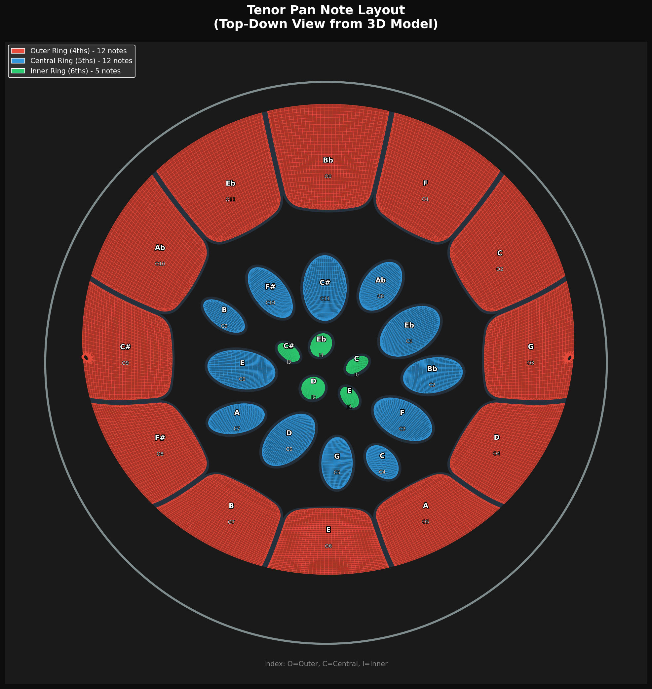

## Interactive Tools

<div style="display: flex; flex-wrap: wrap; gap: 15px; margin: 20px 0;">
  <a href="player.html" style="display: inline-block; padding: 12px 24px; background: #157878; color: white; text-decoration: none; border-radius: 6px; font-weight: bold;">Play the Pan</a>
  <a href="synth.html" style="display: inline-block; padding: 12px 24px; background: #157878; color: white; text-decoration: none; border-radius: 6px; font-weight: bold;">Sound Designer</a>
  <a href="https://colab.research.google.com/github/profLewis/deepPan/blob/main/deepPan_Colab.ipynb" style="display: inline-block;"></a>
</div>

- **[Interactive Pan Player](player.html)** -- Click notes on a steel pan to hear them. Includes sequence playback and 4 visualization modes.
- **[Sound Designer](synth.html)** -- Design steel pan sounds with real-time synthesis, 14 parameter controls, and 5 presets.
- **[Google Colab Notebook](https://colab.research.google.com/github/profLewis/deepPan/blob/main/deepPan_Colab.ipynb)** -- Run the synthesizer in the cloud with no installation.

## Project Overview

This project creates **3D printable note pads** for a tenor steel pan. Each of the 29 notes can be individually printed and mounted, allowing for:
- Replacement of damaged notes
- Experimentation with materials and tuning
- Educational exploration of steel pan acoustics
- Custom pan configurations

The note pads are extracted from a 3D scanned tenor pan model and converted into printable solids with integrated mounting hardware.

## Tenor Pan Layout



The tenor pan has **29 note pads** in three concentric rings:

| Ring | Notes | Interval | Octave |
|------|-------|----------|--------|
| Outer | 12 | 4ths | 4 |
| Central | 12 | 5ths | 5 |
| Inner | 5 | 6ths | 6 |

## Mount System

Each note pad has a three-part mounting system designed for 3D printing:

1. **Note Pad** -- Extracted from a 3D scanned model, thickened to 1.5mm with an integrated threaded mounting cylinder
2. **Mount Base** -- Screws onto the note pad, includes PCB mounting bosses (M2 holes) for electronics
3. **Outer Sleeve** -- Protective housing with 12 grip ridges and cable routing

All threads use a push-fit ring groove design (2mm pitch, 1mm depth, 0.3mm clearance) optimized for FDM printing.

## Sound Design

The synthesizer generates realistic steel pan tones using additive synthesis with 14 adjustable parameters:

| Group | Parameters |
|-------|-----------|
| **Envelope** | Attack, Decay, Sustain, Release |
| **Harmonics** | Fundamental, 2nd/3rd/4th Harmonic, Sub Bass |
| **Character** | Detune, Filter Cutoff, Brightness |
| **Output** | Duration, Volume |

Five built-in presets: Default, Bright, Mellow, Bell, and Pluck.

## Command-Line Tools

```bash
# Generate all sound samples
python generate_sounds.py

# Use a preset
python generate_sounds.py --preset bright

# Play a melody
./deepPanPlay "C4 E4 G4 C5"

# Analyze a WAV file to extract parameters
python analyze_audio.py sample.wav --output params.json
```

## Source

View the full source and documentation on [GitHub](https://github.com/profLewis/deepPan).
